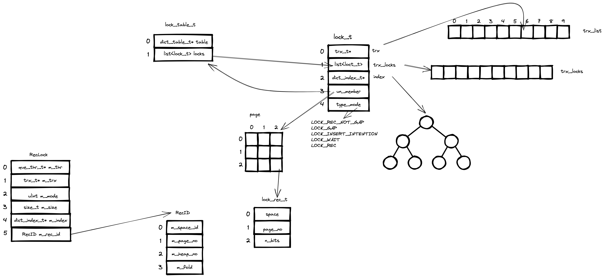

<<<<<<< HEAD
# 相关代码
                                      5.7                                     8.0
  1. lock0iter.cc                    109
  2. lock0lock.cc                    7564
  3. lock0prdt.cc                    1058
  4. lock0wait.cc                    543
  5. lock0types.h                     79
  6. lock0iter.h                      68
  7. lock0lock.h                     1112
  8. lock0prdt.h                     226
  9. lock0priv.h                     1161
  10. lock0lock.ic                   132
  11. lock0priv.ic                   426

  

# 锁子系统

// lock0lock.ic  基本上就是实现lock0lock.h中定义的头文件

// lock0priv.h lock模块内部的结构和方法
// 数据结构
1. lock_table_t 表锁
2. lock_rec_t   页中的记录锁
3. lock_t       实际的锁对象
4. 锁的兼容，矩阵
5. lock_rec_req_status
6. RecID        记录锁id
7. RecLock      记录锁对象

// 函数
1. lock_get_type_low
2. lock_rec_get_prev
3. lock_cancel_waiting_and_release
4. lock_clust_rec_some_has_impl
5. lock_rec_get_next_on_page_const
6. lock_rec_get_nth_bit
7. lock_rec_get_n_bits
8. lock_rec_set_nth_bit
9. lock_rec_get_next_on_page
10. lock_rec_get_first_on_page_dir
11. lock_rec_get_first_on_page
12. lock_rec_get_next
13. lock_rec_get_next_const
14. lock_rec_get_first
15. lock_get_mode
16. lock_mode_compatible
17. lock_mode_stronger_or_eq
18. lock_get_wait
19. lock_rec_find_similar_on_page
20. lock_table_has

// lock0priv.ic 实现 lock0priv.h中定义的锁对象的基本实现

// lock0wait.cc
事务的锁子系统
// 函数
1. lock_wait_table_print
2. lock_wait_table_release_slot
3. lock_wait_table_reserve_slot
4. lock_wait_suspend_thread   // 函数声明在lock0lock.h中
5. lock_wait_release_thread_if_suspended
6. lock_wait_check_cancel
7. lock_wait_timeout_thread

// lock0iter.h
1. lock_queue_iterator_t    数据结构, TODO画图

// 函数
1. lock_queue_iterator_reset
2. lock_queue_iterator_get_prev

// lock0iter.cc 就是对 lock0iter.h 中代码的实现

// lock0prdt.h  谓词锁
// 数据结构
1. lock_prdt  lock_prdt_t

// 函数
1. lock_prdt_lock
2. lock_place_prdt_page_lock
3. lock_prdt_consistent
4. lock_init_prdt_from_mbr
5. lock_get_prdt_from_lock
6. lock_prdt_has_to_wait
7. lock_prdt_update_split
8. lock_prdt_update_parent
9. lock_prdt_insert_check_and_lock
10. lock_prdt_set_prdt
11. lock_prdt_rec_move
12. lock_test_prdt_page_lock
13. lock_prdt_page_free_from_discard

// lock0prdt.cc
1. prdt_get_mbr_from_prdt
2. lock_prdt_get_mbr_from_lock
3. lock_prdt_has_lock
4. lock_prdt_other_has_conflicting
5. lock_prdt_enlarge_mbr
6. lock_prdt_enlarge_prdt
7. lock_prdt_is_same
8. lock_prdt_find_on_page
9. lock_prdt_and_to_queue
10. lock_prdt_update_split_low

=======
# 锁子系统

>>>>>>> 26fed75012770ed016b764372c066a832e0e5e4b
// lock0lock.h
1. lock_get_size
2. lock_sys_create
3. lock_sys_resize
4. lock_sys_close
5. lock_get_min_heap_no
6. lock_move_reorganize_page
7. lock_move_rec_list_end
8. lock_move_rec_list_start
9. lock_update_split_right
10. lock_update_merge_right
11. lock_update_root_raise
12. lock_update_copy_and_discard
13. lock_update_split_left
14. lock_update_merge_left
15. lock_rec_reset_and_inherit_gap_locks
16. lock_update_discard
17. lock_update_insert
18. lock_update_delete
19. lock_rec_store_on_page_infimum
20. lock_rec_restore_from_page_infimum
21. lock_rec_expl_exist_on_page
22. lock_rec_insert_check_and_lock
23. lock_rec_enqueue_waiting
24. lock_rec_dequeue_from_page
25. lock_rec_move
26. lock_rec_move_low
27. lock_clust_rec_modify_check_and_lock
28. lock_sec_rec_modify_check_and_lock
29. lock_sec_rec_read_check_and_lock
30. lock_clust_rec_read_check_and_lock
31. lock_clust_rec_read_check_and_lock_alt
32. lock_clust_rec_cons_read_sees
33. lock_sec_rec_cons_read_sees
34. lock_table
35. lock_table_ix_resurrect
36. lock_table_for_trx
37. lock_rec_unlock
38. lock_trx_release_locks
39. lock_trx_release_read_locks
40. lock_remove_all_on_table
41. lock_rec_fold
42. lock_rec_hash
43. lock_hash_get
44. lock_rec_find_set_bit
45. lock_get_src_table
46. lock_is_table_exclusive
47. lock_has_to_wait
48. lock_report_trx_id_insanity
49. lock_table_print
50. lock_rec_print
51. lock_print_info_summary
52. lock_trx_print_wait_and_mvcc_state
53. lock_print_info_all_transactions
54. lock_number_of_rows_locked
55. lock_number_of_tables_locked
56. lock_get_type
57. lock_get_trx_id
58. lock_get_mode_str
59. lock_get_type_str
60. lock_get_table_id
61. lock_get_table_name
62. lock_rec_get_index
63. lock_rec_get_index_name
64. lock_rec_get_space_id
65. lock_rec_get_page_no
66. lock_table_has_locks
67. lock_wait_timeout_thread
68. lock_wait_release_thread_if_suspended
69. lock_wait_suspend_thread
70. lock_unlock_table_autoinc
71. lock_trx_handle_wait
72. lock_table_get_n_locks
73. lock_trx_lock_list_init
74. lock_set_timeout_event
75. lock_check_trx_id_sanity
76. lock_trx_has_sys_table_locks
77. lock_trx_has_rec_x_lock
78. lock_trx_alloc_locks
79. lock_rec_discard
80. lock_rtr_move_rec_list
81. lock_rec_free_all_from_discard_page
82. lock_rec_trx_wait

// 定义的宏
1. LOCK_TABLE
2. LOCK_REC
3. LOCK_WAIT
4. LOCK_GAP
5. LOCK_PREDICATE
6. LOCK_PRDT_PAGE

lock_op_t

lock_sys_t 锁子系统全局唯一的数据结构

// lock0lock.ic
这个函数主要是实现lock0lock.h中头文件定义的函数

// lock0types.h
  // 数据结构
  lock_mode    IS, IX, S, X, AI
// 函数
1. lock_mode_string

// lock0lock.cc
  // 数据结构
  1. DeadlockChecker 死锁检查  todo画个图
  2. lock_sys_t* lock_sys = null;

<<<<<<< HEAD
  // 函数, 实现了lock0lock.h, lock0priv.h 
=======
  // 函数
>>>>>>> 26fed75012770ed016b764372c066a832e0e5e4b
  大部分实现了lock0lock.h中定义锁逻辑
  1. lock_validate
  2. lock_rec_validate_page
  3. lock_rec_lock_fold
  4. lock_set_lock_and_trx_wait
  5. lock_reset_lock_and_trx_wait
  6. lock_rec_get_gap
  7. lock_rec_get_rec_not_gap
  8. lock_rec_get_insert_intention
  9. lock_rec_has_to_wait
<<<<<<< HEAD
  10. lock_rec_reset_nth_bit       
  11. lock_rec_bitmap_reset
  12. lock_rec_copy
  13. lock_rec_get_prev        // lock0priv.h
  14. lock_rec_has_expl
  15. lock_rec_other_has_expl_req
  16. lock_rec_other_has_conflicting
  17. lock_sec_rec_some_has_impl
  18. lock_rec_other_trx_holds_expl
  
  // RecLock   
  lock0priv.h
  19. RecLock 相关的成员函数
  20. lock_rec_add_to_queue
  21. lock_rec_lock_fast
  22. lock_rec_lock_slow
  23. lock_rec_lock
  24. lock_rec_has_to_wait_in_queue
  25. lock_grant
  26. lock_rec_cancel
  27. lock_rec_free_all_from_discard_page_low
  28. lock_rec_reset_and_release_wait_low
  29. lock_rec_reset_and_release_wait
  30. lock_rec_inherit_to_gap
  31. lock_rec_inherit_to_gap_if_gap_lock
  32. lock_move_granted_locks_to_front
  33. lock_table_create
  34. lock_table_pop_autoinc_locks
  35.  lock_table_remove_autoinc_lock
  36. lock_table_remove_low
  37. lock_table_enqueue_waiting
  38. lock_table_other_is_incompatible
  39. lock_table_has_to_wait_in_queue
  40. lock_table_dequeue
  41. lock_check_dict_lock
  42. lock_release
  43. lock_trx_table_locks_remove
  44. lock_remove_all_on_table_for_trx
  45. lock_remove_recovered_trx_record_locks
  46. lock_get_n_rec_locks
  
  // 数据结构
  PrintNotStarted
  TrxLockIterator
  TrxListIterator

  47. lock_rec_fetch_page
  48. lock_trx_print_locks
  49. lock_trx_table_locks_find
  50. lock_table_queue_validate
  51. lock_rec_queue_validate
  52. lock_validate_table_locks
  53. lock_rec_validate
  54. lock_rec_block_validate
  55. lock_rec_convert_impl_to_expl_for_trx
  56. lock_rec_convert_impl_to_expl
  57. lock_clust_rec_modify_check_and_lock
  58. lock_release_autoinc_last_lock
  59. lock_trx_holds_autoinc_locks
  60. lock_release_autoinc_locks
  61. lock_get_table
  62. lock_table_locks_lookup
  
  DeadlockChecker 相关的系列函数

=======
  10. lock_rec_reset_nth_bit          line: 948
>>>>>>> 26fed75012770ed016b764372c066a832e0e5e4b
