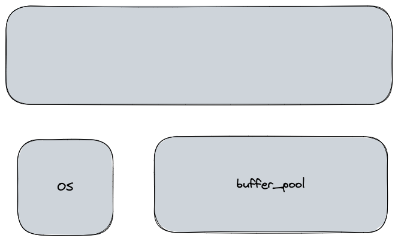

# 介绍

|文件名称|5.7|8.0|
|-|-|-|
|mem0mem.cc|481|
|mem0mem.h|517|
|mem0mem.ic|612|
|-|1610|



内存堆核心数据结构
```cpp
struct mem_block_info_t
{
    ulint magic_n;
    char file_name[8];  // 分配内存的文件
    ulint line;         // 分配内存的文件所在行
    UT_LIST_BASE_NODE_T(mem_block_t) base;  // 头节点
    UT_LIST_NODE_T(mem_block_t) list;  // 基础的已分配内存列表
    ulint type;  // 依赖底层分配类型 HEAP_DYNAMIC, MEM_HEAP_BUF, MEM_HEAP_BTR_SEARCH
    ulint free;  // 第一个空闲的地址, 
    ulint start;  // 第一次创建的时候的free地址
    void* free_block;  备用block, 仅仅在BTR_SEARCH方式可用
}

typedef struct mem_block_info_t mem_block_t;
typedef mem_block_t mem_heap_t;

```

通过上面的代码片段，我们知道一个内存堆，它是由一个个的block块组成的，这些block块以双向链表的形式组织在一起，形成了一个堆。其中每个block块的内存结构和堆是一样的，
因此可以简单的把内存堆想象成一个抽象的内存block块集合。

通过这个数据结构，我们知道在innodb引擎中，内存堆总体上来说可以来自两个方向：
1. HEAP_DYNAMIC， 该类型代表内存堆来自malloc/new
2. MEM_HEAP_BUF  该类型代表内存堆的内存来自buffer pool

mem_heap_t 的几个要点知识梳理:
1. 一个mem_block_t 最小空间不小于64字节，标准的大小是8KB, 在非MEM_HEAP_BUFFER模式下分配的空间不大于 page size - 200 字节 (page size 一般为16KB)  TODO? 分析为啥
2. mem_heap_t 有三种类型
   * dynamic
   * buffer pool
   * btr_search

在dynamic模式下都是基于buddy伙伴系统来进行分配的。


<style>
table th:first-of-type {
    width: 40%;
}
table th:nth-of-type(2) {
    width: 50%;
}
table th:nth-of-type(3) {
    width: 10%;
}
</style>
|宏名称|注解|备注|
|-|-|-|
|mem_heap_create(size)|这种情况下，默认使用MEM_HEAP_DYNAMIC模式||
|mem_heap_create_typed(size, type)|和mem_heap_create方式一样，只不过这个宏可以指定mem堆的类型||


# 函数梳理

<table>
<colgroup>
    <col style="width:30%">
    <col style="width:50%">
    <col style="width:20%">
</colgroup>
<tr>
<td> 函数名称 </td> <td> 注解 </td> <td> 备注 </td>
</tr>
<tr>
<td> 

```cpp
mem_heap_create_func(ulint size, const char* file_name, ulint line, ulint type) 
```
</td>
<td>
默认size如果为0,那么默认就取64字节，如果size < 64字节呢？这个写法不是很好，可以参考下8.0版本的代码实现, 然后就是根据大小和类型创建一个block块, 第一个block块不应该在buffer pool中，设置buf_block为空, 第一个块初始化base节点，并且把当前的block块添加到base链表中去
</td>
<td></td>
</tr>
<tr>
<td>

```cpp
mem_heap_free(mem_heap_t* heap)
```
</td>
<td>
首先是获取内存堆的base节点, 如果free_block不为空，那么要释放free_block; 

```cpp
while(block != NULL) {
  prev_block = UT_LIST_GET_PREV(list, block);  // 对于双向链表base节点的prev就是最后一个节点
  mem_heap_block_free(heap, block); // 释放heap中最后的一个block块，直到内存堆中所有的block块都free掉
  block = prev_block;
} 
```
</td>
<td>TODO: 研究free_block的作用</td>
</tr>
<tr>
<td>

```cpp
mem_heap_get_size(mem_heap_t* heap)
```
</td>
<td>返回heap占用的内存大小 total_size|如果是有free_block那么还需要添加一个页的大小16kb</td>
<td></td>
</tr>
<tr>
<td>

```cpp
mem_strdup(const char* str)
```
</td>
<td>ut_malloc_nokey分配一块内存容纳str,然后把str拷贝过去，返回新指针</td>
<td></td>
</tr>
<tr>
<td>

```cpp
mem_strdupl(const char* str, ulint len)
```
</td>
<td>功能和mem_strdup函数一样，只是这里用户可以控制长度len</td>
</tr>
<tr>
<td>

```cpp
char* mem_heap_strdupl(mem_heap_t* heap, const char* str, ulint len)
```
</td>
<td>
相比之前的strdup系列的函数，这个函数多了一个Heap形参，也就是说可以指定在具体的heap上来拷贝字符串
</td>
</tr>
<tr>
<td>

```cpp
void* mem_heap_zalloc(mem_heap_t* heap, ulint n)
```
</td>
<td>在指定的内存堆上分配内存，并且把前n个字节用0来填充</td>
</tr>
<tr>
<td>

```cpp
void* mem_heap_alloc(mem_heap_t* heap, ulint n)
```
</td>
<td>
1. 首先是验证heap, 取出链表的最后一个节点
2. 断言block的类型不是MEM_HEAP_BUFFER, 要分配的内存大小小于一个页-200字节
3. 判断一下是否有足够的空闲空间，如果没有足够的空闲空间，那么就创建一个新的block块，添加到heap堆中去
   注意分配的内存是按照8字节对齐的。
4. todo
</td>
</tr>
<tr>
<td>

```cpp
byte* mem_heap_get_heap_top(mem_heap_t* heap)
```
</td>
<td>todo</td>
</tr>
<tr>
<td>

```cpp
void mem_heap_free_heap_top(mem_heap_t* heap, byte* old_top)

```
</td>
<td>todo</td>
</tr>
<tr>
<td>

```cpp
void mem_heap_empty(mem_heap_t* heap)
```
</td>
<td></td>
</tr>
<tr>
<td>

```cpp
void* mem_heap_get_top(mem_heap_t* heap, ulint n)
```
</td>
<td></td>
</tr>
<tr>
<td>

```cpp
bool mem_heap_is_top(mem_heap_t* heap, const void * buf, ulint buf_sz)
```
</td>
<td></td>
</tr>
<tr>
<td>

```cpp
void* mem_heap_replace(mem_heap_t* heap, const void* top, ulint top_sz, ulint new_sz)

```
</td>
<td></td>
</tr>
<tr>
<td>

```cpp
void* mem_heap_dup_replace(mem_heap_t* heap, const void* top, ulint top_sz, const void* data, ulint data_sz)
```
</td>
<td></td>
</tr>
<tr>
<td>

```cpp
mem_heap_strdup_replace(mem_heap_t* heap, const void* top, ulint top_sz, const char* str)
```
</td>
<td></td>
</tr>
<tr>
<td>

```cpp
void mem_heap_free_top(mem_heap_t* heap, ulint n)
```
</td>
<td></td>
</tr>
<tr>
<td>

```cpp
char* mem_heap_strcat(mem_heap_t* heap, const char* s1, const char* s2)
```
</td>
<td>在内存堆heap上，分配内存，然后把s1和s2连接起来返回新的指针</td>
</tr>
<tr>
<td>

```cpp
void* mem_heap_dup(mem_heap_t* heap, const void* data, ulint len)
```
</td>
<td>分配len长度的内存，然后把data拷贝到新的内存返回</td>
<td>依赖函数mem_heap_alloc</td>
</tr>
<tr>
<td>

```cpp
char* mem_heap_printf(mem_heap_t* heap, const char* format, ...)
```
</td>
<td>根据指定的格式来打印， 比如说, s, u, l等类型</td>
<td>这个函数底层依赖其他的函数，todo</td>
</tr>
<tr>
<td>

```cpp
void mem_block_validate(const mem_heap_t* heap)
```
</td>
<td>验证heap的有效性</td>
<td>主要是验证block块上的magic_n魔数，是否为MEM_BLOCK_MAGIC_N,
注意：这里的形参是mem_heap_t*， 而在定义的时候是mem_block_t*， 这个写的不严谨
</td>
</tr>
<tr>
<td>

```cpp
void mem_heap_validate(const mem_heap_t* heap)
```
</td>
<td>对于内存堆的检查是，从头开始遍历mem_block内存块，检查其magic_n是否正确，对于不同的block类型，
比如说：MEM_HEAP_DYNAMIC类型，在检查的时候会直接退出。而只有MEM_HEAP_BUFFER和MEM_HEAP_BTR_SEARCH类型，在检查的时候会去判断block的大小要小于一个内存页.

```cpp
ut_add(block->len <= UNIV_PAGE_SIZE);
```

除此之外，就是检查heap的大小应为所有block的大小之和。
</td>
<td>显然只有在heap的第一个block才会设置total_size</td>
</tr>
<tr>
<td>

```cpp
char* mem_heap_strdup(mem_heap_t* heap, const char* str)
```
</td>
<td>在内存堆上分配内存，拷贝字符串，然后返回内存指针</td>
<td>类比mem_heap_dup, 只不过这个函数只操作字符串, 底层是先依赖mem_heap_dup函数</td>
</tr>
<tr>
<td>

```cpp
ulint mem_heap_printf_low(char* buf, const char* format, va_list ap)
```
</td>
<td>todo</td>
<td></td>
</tr>
<tr>
<td>

```cpp
mem_block_t* mem_heap_create_block_func(mem_heap_t* heap, ulint n, const char* file_name, ulint line, ulint type)
```
</td>
<td>todo</td>
</tr>
<tr>
<td>

```cpp
mem_block_t* mem_heap_add_block(mem_heap_t* heap, ulint n)
```
</td>
<td>
1. 验证heap, 取出队列的尾结点block, 也就是说每次分配内存的时候都是从尾部节点分配的
2. 获取获取老的block大小，然后扩大2倍
3. 如果heap的类型不是dynamic的话，也就是从buffer pool中取， 那么要保证分配的内存最大为  (页大小-200字节)
   同时，每次扩大2倍的上限就是MEM_MAX_ALLOC_IN_BUF
   但是如果页的大小，大于16kb, 那么我们就取8000, 不然还是取MEM_MAX_ALLOC_IN_BUF
4. 根据新的大小，类型创建一个新的bloc块, 显然新的block块的大小是之前链表末尾大小的2倍
5. 把新的block块，添加在链表的尾部
</td>
</tr>
<tr>
<td>

```cpp
void mem_heap_block_free(mem_heap_t* heap, mem_block_t* block)
```
</td>
<td>

1. 先把buf_block 转换为 buf_block_t* 
2. 验证mem block
3. 把当前block从堆的链表中移除
4. 修改堆的内存大小
5. 获取block块的大小和堆的类型
6. 修改block块的magic_n，把其状态设置为freed (MEM_FREED_BLOCK_MAGIC_N)
7. 如果类型是dynamic 或者block块的大小小于8kb, 那么久直接调用free把内存释放掉,
    如果不是dynamic并且内存的大小大于等于8kb那么就调用buf_block_free(buf_block), todo放回free list？这块要看下buf pool的管理
</td>
<td>了解下buf_block_free函数, 也就是说如果这个页是来自buf pool 的话，就会设置block的buf_block字段</td>
</tr>
<tr>
<td>

```cpp
void mem_heap_free_block_free(mem_heap_t* heap)
```
</td>
<td>如果heap的free_block不为空，那么就把heap的free_block, 调用buf pool 的管理函数buf_block_free 释放掉</td>
</tr>
<tr>
<td>
</table>


