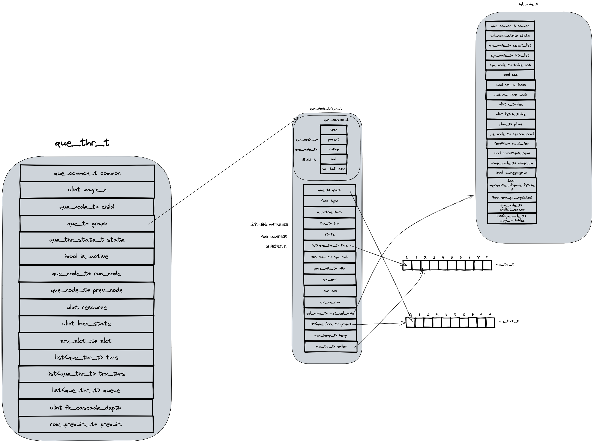

# 相关代码

```
que0que.h                    517
que0que.ic                   309
que0que.cc                   1266
```
5.7版本的代码： 2092



typedef struct que_fork_t que_t


// que0que.h
// 数据结构
1. que_fork_t
2. que_thr_t
3. que_node_t


// 函数
1. que_fork_create
2. que_fork_get_first_thr
3. que_fork_get_child
4. que_node_set_parent
5. que_thr_create
6. que_graph_free_recursive
7. que_graph_free
8. que_thr_stop
9. que_thr_move_to_run_state_for_mysql
10. que_thr_stop_for_mysql_no_error
11. que_thr_stop_for_mysql
12. que_run_threads
13. que_thr_end_lock_wait
14. que_fork_start_command
15. thr_get_trx
16. thr_is_recv
17. que_node_get_type
18. que_node_get_data_type
19. que_node_get_val
20. que_node_get_val_buf_size
21. que_node_set_val_buf_size
22. que_node_get_next
23. que_node_get_parent
24. que_node_get_containing_loop_node
25. que_node_list_add_last
26. que_node_list_get_last
27. que_node_list_get_len
28. que_thr_peek_stop
29. que_graph_is_select
30. que_node_print_info
31. que_eval_sql
32. que_fork_scheduler_round_robin
33. que_init           // query 子系统
34. que_close

// 查询线程状态
1. que_thr_state_t
// 查询线程锁状态
2. que_thr_lock_t
// 查询线程，游标状态
3. que_cur_t
4. que_thr_t
5. que_fork_t

// query fork 类型

// que0que.ic


// que0que.cc
1. que_thr_init_command
2. que_graph_free_stat_list
3. que_thr_node_step
4. que_thr_dec_refer_count
5. que_node_type_string
6. que_thr_step
7. que_run_threads_low