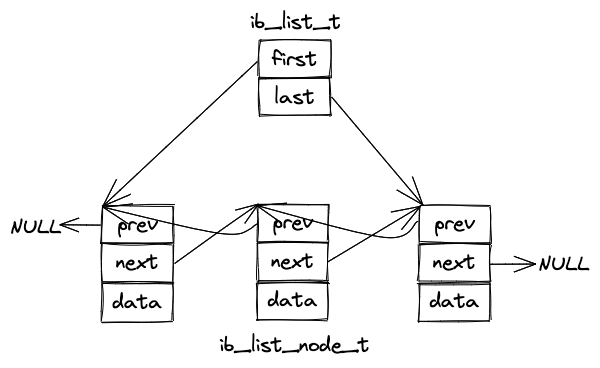

# 双向链表

涉及文件:
include/ut0list.h
include/ut0list.ic
ut/ut0list.cc

链表基节点（即ib_list_t）包含分别指向链表的头节点（first）和尾节点(last)的指针。
链表节点（即ib_list_node_t）包含指向数据的指针，以及分别指向前继节点（prev）和后继节点（next）的指针。

该双向链表和ut0lst.h中的双向链表的不同之处在于：ut0list.h中的双向链表的每一个节点都包含一个指向数据的指针，然而ut0lst.h中的双向链表的指针内嵌在数据本身。
当数据中不能内嵌链表指针时，可以使用该双向链表，例如一个数据项需要存储在多个链表等情况。

在内存管理上需要注意，链表基节点是一个固定大小的结构体，其分配和释放是通过ib_list_create和ib_list_free函数完成的。但是链表节点的内存是通过用户给定的内存堆分配的，所有节点可能相同也可能因节点而已。大多数用户可能希望创建一个内存堆来存储特定的数据项，并在调用链表节点创建函数时传递同一个堆，从而在数据项的堆被释放时自动释放链表节点。

相关函数：
函数名|用途
-|-
ib_list_create|创建链表（必须使用ib_list_free释放）|
ib_list_free|释放链表|
ib_list_add_last|追加节点到链表尾部|
ib_list_remove|移除指定节点|
ib_list_get_first|获取头节点|
ib_list_get_last|获取尾部节点|
ib_list_is_empty|判断是否为空链表|

图1 双向链表示意图